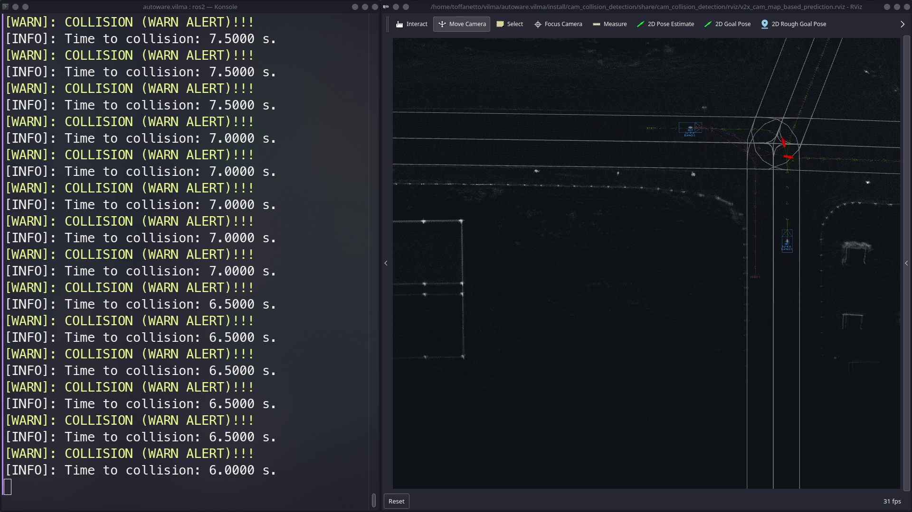

# CAM-Based Collision Detector

Given the vehicle position:

$$
\mathbf{x} = \begin{bmatrix} x \\ y \\ z \end{bmatrix}
$$

The predicted trajectory is given in $N$ points over the prediction horizon:

$$
\mathbf{x}(n) =  \begin{bmatrix} x(n) \\ y(n) \\ z(n) \end{bmatrix}, \text{ for } n \in (0,N)
$$

Given the trajectory of vehicles $A$ and $B$, collision occurs if:

$$
\|\mathbf{x}_A(n) - \mathbf{x}_B(n)\|  < \mathbf{\epsilon} 
$$

Where $\mathbf{\epsilon}$ defines a threshold for collision, and collision step is given by $n_c$, being the first $n$ that makes the inequation above true.

The hazardous of the predicted collision is given by the time to the collision occur. As the timestep $t_s$, the time to collision given by $n_c$ is:

$$
t_c = n_c \times (t_s + 1)
$$